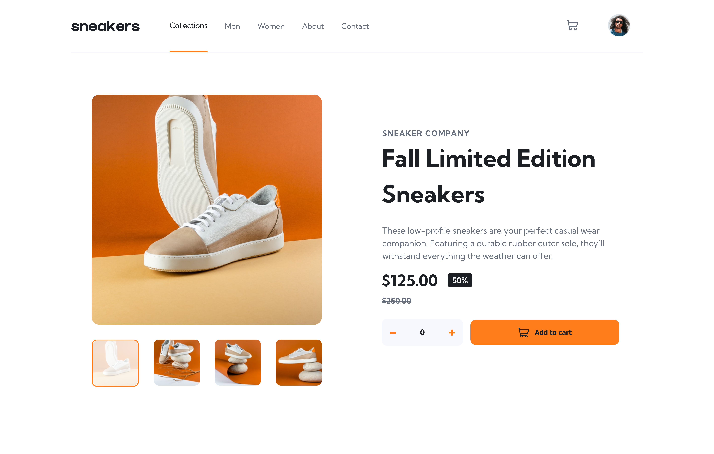
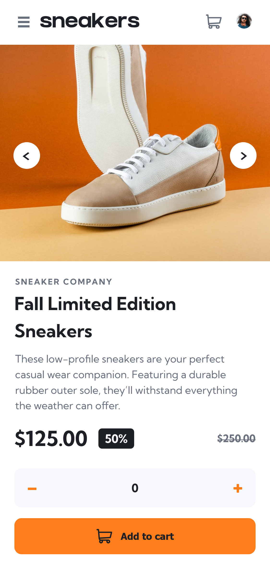
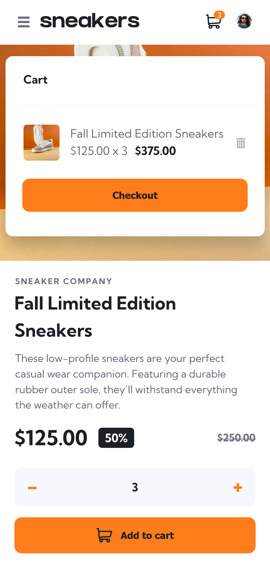

# Frontend Mentor - E-commerce product page solution

This is a solution to the [E-commerce product page challenge on Frontend Mentor](https://www.frontendmentor.io/challenges/ecommerce-product-page-UPsZ9MJp6). Frontend Mentor challenges help you improve your coding skills by building realistic projects.

## Table of contents

- [Frontend Mentor - E-commerce product page solution](#frontend-mentor---e-commerce-product-page-solution)
  - [Table of contents](#table-of-contents)
  - [Overview](#overview)
    - [The challenge](#the-challenge)
    - [Screenshots](#screenshots)
    - [Links](#links)
  - [My process](#my-process)
    - [Built with](#built-with)
    - [What I learned](#what-i-learned)
    - [Continued development](#continued-development)
    - [Useful resources](#useful-resources)
  - [Author](#author)

## Overview

### The challenge

Users should be able to:

- View the optimal layout for the site depending on their device's screen size
- See hover states for all interactive elements on the page
- Open a lightbox gallery by clicking on the large product image
- Switch the large product image by clicking on the small thumbnail images
- Add items to the cart
- View the cart and remove items from it

### Screenshots

<p align="center">
  
</p>

<div style="display: flex; justify-content: center; gap: 15px">
  
  
</div>

### Links

- Solution URL: [to be added after submission](https://your-solution-url.com)
- Live Site URL: [Live site](https://react-sneakers-ecommerce.vercel.app/)

## My process

### Built with

- Mobile-first workflow
- Semantic HTML5 markup
- CSS modules
- CSS Variables
- TypeScript
- Flexbox
- React
- ReactDOM (for portals)

### What I learned

- Gained hands-on experience with TypeScript, including typing props and state in React
- Learned to use CSS variables for consistent theming and easier maintenance
- Practiced a mobile-first workflow, ensuring layouts scale nicely across devices.
- Improved creating portals with ReactDOM.createPortal for modals/lightbox.
- Improved skills in React component structuring and state management with props.
- Explored React Context API for potential shared state management (cart state), planning to implement fully in future iterations.

```tsx
<>
  <button
    className={`${styles.arrow} ${styles.left_arrow} ${styles[variant]}`}
    onClick={onPrev}
    aria-label="Previous image"
  >
    
  </button>
  <button
    className={`${styles.arrow} ${styles.right_arrow} ${styles[variant]}`}
    onClick={onNext}
    aria-label="Next image"
  >
    
  </button>
</>
```

I’m proud of this snippet because it shows how I componentized the carousel arrows for reusability across different components, keeping the markup clean and accessible.

The onNext and onPrev functions handle the current image index, allowing smooth navigation between images in both the mobile gallery and the lightbox.

```css
.arrow {
  position: absolute; /* Posição controlada pelo pai */
  top: 45%;
  border: none;
  border-radius: 50%;
  background-color: hsl(0, 0%, 100%);
  cursor: pointer;
  width: 37px;
  height: 37px;
  -webkit-tap-highlight-color: transparent; /* Previne o efeito de highlight no mobile */
  z-index: 1;
}

.arrow:active {
  transform: scale(0.95); /* Efeito de clique */
  transition: transform 0.1s ease;
}
```

I'm proud of this CSS because it allows the arrows to be reused in different components, with their position being controlled by the parent component.

### Continued development

I plan to implement Context API for the cart state to reduce prop drilling, refine the lightbox carousel functionality, and improve accessibility across all components.

Even though TypeScript already provides strong typing, I plan to add more documentation for the props and functions. I also want to refine the TSX structure, focusing on better semantics and accessibility.

### Useful resources

Coming soon – I didn’t use specific resources beyond documentation this time.

## Author

- Website - [Erick Nunes](https://meuport-dev.vercel.app/)
- Frontend Mentor - [@rick-oss](https://www.frontendmentor.io/profile/rick-oss)
- Linkedin - [@nunes-erick](https://www.linkedin.com/in/nunes-erick/)
